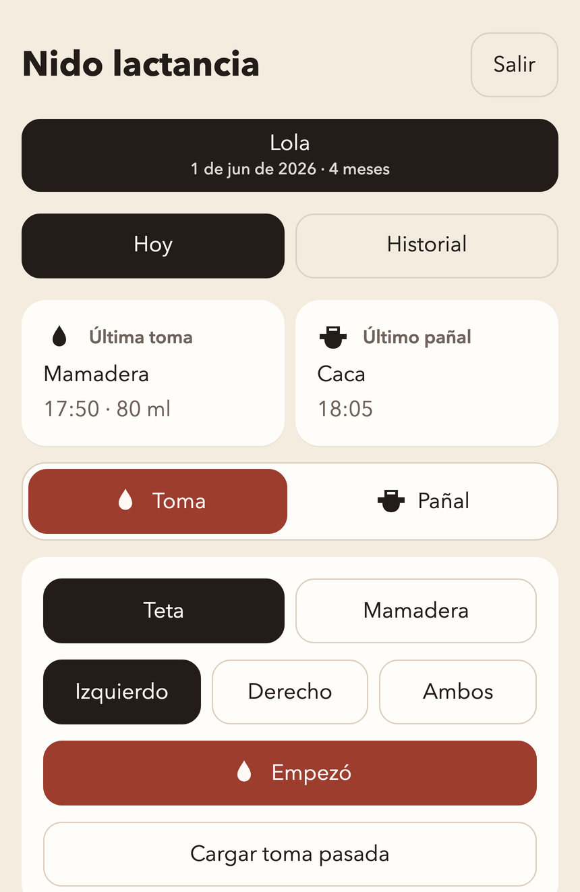
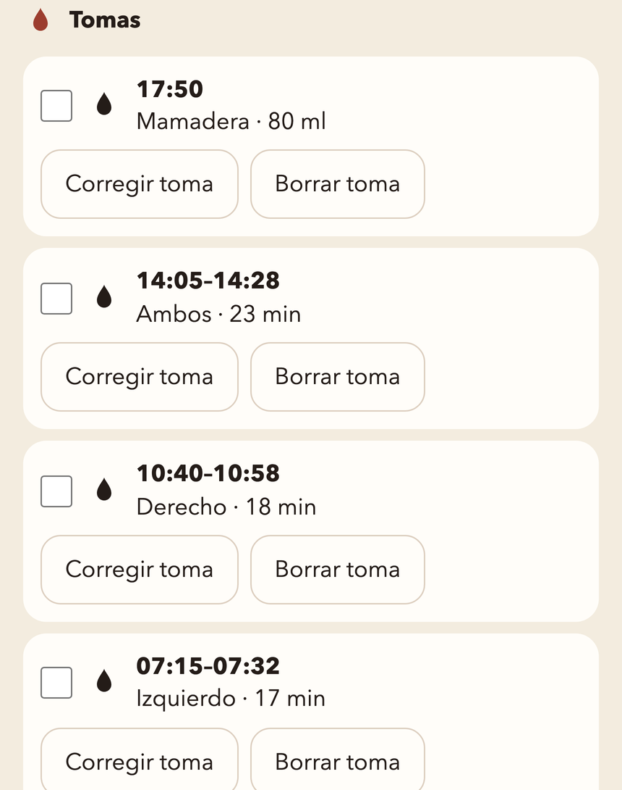
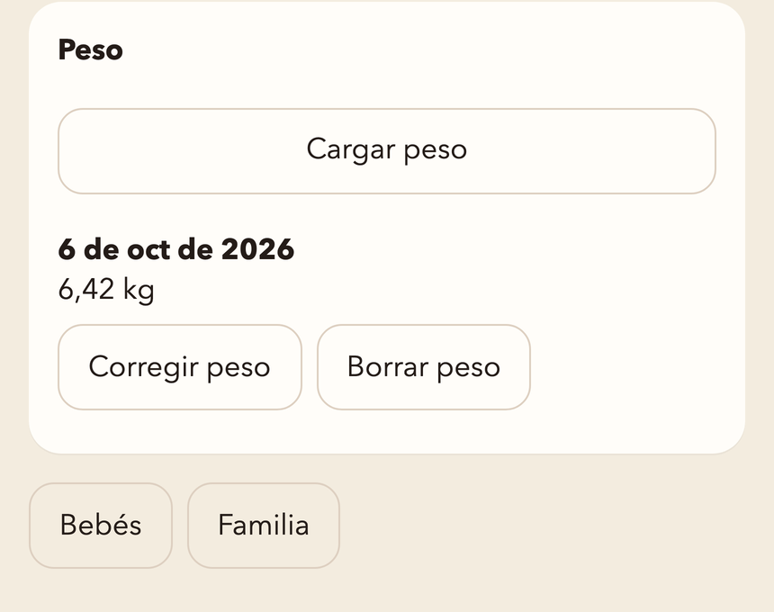

# Nido lactancia

[](https://github.com/sebaserritella/nido-lactancia/actions/workflows/deploy-pages.yml)
[](https://sebaserritella.github.io/nido-lactancia/)

Web para anotar tomas y pañales, compartida entre dos personas. Sin configurar Supabase, la página guarda los datos en el navegador. Con Supabase, los datos viven en Postgres y los ven los dos teléfonos.

Cada teléfono guarda la sesión en el navegador. Al volver a abrir la página no pide la contraseña, hasta que alguien toca Salir o borra los datos del sitio.

Datos de ejemplo:

<p>
  
  
  
</p>

## Correr en local

1. Creá un proyecto en [Supabase](https://supabase.com).
2. Authentication → Providers → Email: dejalo activo y apagá **Confirm email**.
3. En el SQL Editor, ejecutá en orden todos los archivos de `supabase/migrations/`, del `0001` al último.
4. Copiá `.env.example` a `.env.local` y completá la Project URL y la anon key. `VITE_FIREBASE_MEASUREMENT_ID` es opcional: sin ese valor la página no manda analíticas.
5. Instalá y levantá la app:

```bash
npm install
npm test
npm run dev
```

La cuenta es un correo real y una contraseña. Supabase guarda la contraseña hasheada. Un apodo, sin `@`, no se puede registrar. **Olvidé mi contraseña** manda un enlace a ese correo; al abrirlo, la página pide una contraseña nueva. El mail de prueba de Supabase solo entrega ese enlace a los correos del equipo del proyecto. Para que le llegue a cualquier cuenta, hay que configurar un SMTP propio en Authentication → Emails.

La primera persona elige **Crear familia**. Desde **Familia** invita a la otra por correo. Si esa persona ya tiene cuenta, ve los bebés al entrar. Si no, los ve cuando se registra con ese mismo correo.

## Qué se guarda

| Dato | Dónde |
|---|---|
| Tomas, pañales, bebés, familia | Postgres de Supabase, hora en UTC |
| Contraseña | Auth de Supabase |
| Sesión | `localStorage` del navegador |
| Uso de la página | Firebase Analytics, solo pantallas y acciones |
| La página | GitHub Pages, cuando la publiques |

En pantalla, la hora es la del dispositivo.

## Analíticas

El plan Spark de Firebase es gratis. El build usa `VITE_FIREBASE_MEASUREMENT_ID` (`G-…`). Sin esa variable no se envía nada.

Se manda el nombre de la pantalla y de la acción (`screen_view`, `app_opened`, toma, pañal, mamadera, peso, invitación) y si salió bien o mal. No se manda el nombre del bebé, el correo, los kilos, los mililitros, el lado ni el horario.

Un usuario distinto es un navegador, por la cookie de Google. El mismo correo en el teléfono y en la computadora cuenta como dos. Los gráficos del tablero de Firebase tardan unas horas. Lo que acaba de pasar se ve en Google Analytics → Resumen en tiempo real.

## Publicar en GitHub Pages

Settings → Pages → Source: GitHub Actions. El workflow `.github/workflows/deploy-pages.yml` corre los tests y publica `main`. El build lee `VITE_SUPABASE_URL`, `VITE_SUPABASE_ANON_KEY` y `VITE_FIREBASE_MEASUREMENT_ID`. Con las dos de Supabase, la página publicada guarda en Supabase. Sin ellas, guarda solo en el navegador.

El proyecto gratis de Supabase se pausa si nadie entra durante 7 días. Hay que restaurarlo desde el dashboard.
